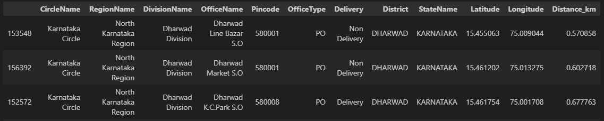

## Postrank Algorithm

This is a simple algorithm that is used to find nearby locations for any given location ```x```.

Examples: 

### - Find Nearby PostOffices

x : Amarajyothi Hospital, Kamalapur Road, Dharwad, Karnataka

output: Returns the valid PinCode for the area and returs the nearest post offices to ```x``` and its details!

